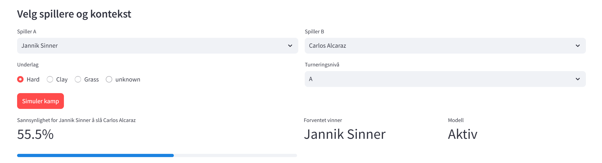
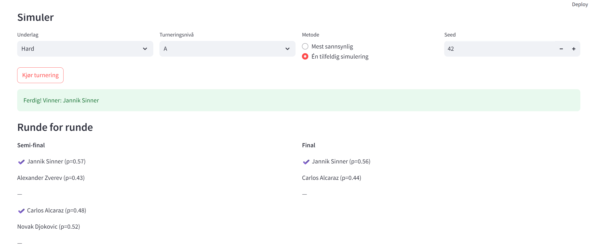

# Tennis Prediction AI

This is a project where I have built a machine learning system to predict the outcome of tennis matches and tournaments.  
The app is built with Streamlit and lets you simulate matchups and entire tournaments interactively.

## Project Overview

The model is trained on ATP match data from 2018–2024 and uses ensemble methods (Random Forest and XGBoost) together with domain-specific features.  
It reaches an accuracy of about **65.2%**, which is in line with or better than many professional betting models.

## Features

- **Matchup simulator**: choose two players, surface and tournament level, and get win probabilities.  
- **Tournament simulator**: simulate a bracket (up to 8 players), see round-by-round results, or run Monte Carlo simulations to estimate winning chances.  
- **Feature engineering**: surface-specific Elo ratings, recent form (last 10 matches), head-to-head stats, tournament weighting, age and ranking differences.  
- **Interactive dashboard**: visual results, feature values used in the predictions, and simple performance metrics.

## Performance

| Metric              | Value   | Benchmark                                |
|---------------------|---------|------------------------------------------|
| Accuracy            | 65.2%   | Professional betting systems: 55–65%     |
| Precision           | 65.1%   | Industry standard                        |
| Data Coverage       | 18,877 matches | 2018–2024 ATP Tour              |
| Temporal Validation | Rolling window | Realistic future prediction setup |

## Tech Stack

- Python 3.8+  
- Scikit-learn, XGBoost  
- Pandas, NumPy  
- Plotly, Matplotlib, Seaborn  
- Streamlit (dashboard)  

---

## Getting Started

### 1. Clone the repository
git clone https://github.com/<birkthomassen>/TennisPredictor.git
cd TennisPredictor

### 2. Install requirements
pip install -r requirements.txt

### 3. Train the model (must be done before running the app)
python train.py

### 4. Run the app
python -m streamlit run app.py 

## Example Screenshots

